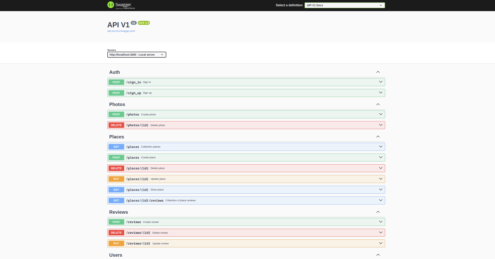

Historica
==========


## Idea behind the project
Sometimes you want to capture places not only in photographs, but also add a name to them, a detailed description of what is happening at that moment. 
Historica allows you to do just that, to capture a place not only in your memory, but also to share it with other people.

## System architecture

This is my idea of how entire system should work in production. 
Docker compose does not have some components, for example, a load balancer, and there is also no cache. 
There is only one redis, but it stores jobs from sidekiq. 
In production redis there should be two, one for the cache, the second for sidekiq. 
The diagram shows S3, where the pictures should be stored. 
In test mode, pictures are stored in memory, and in development mode they are stored in the file system. 
Postgresql is used as a database and meilisearch as a search engine. 
And also do search by typing, and this will not damage your database!

## Swagger


## Search
Meilisearch is used as a search engine. 
Although the rest api has an endpoint that allows full-text search, for clients I strongly recommend using [meilisearch-js](https://github.com/meilisearch/meilisearch-js?tab=readme-ov-file) or a similar library for your programming language. 
All libraries can be found on the [meilisearch website](https://www.meilisearch.com/docs/learn/what_is_meilisearch/sdks). With meilisearch you can find not only matches in the title or description, but even do a geo-search.

## <a name="local_setup"></a>Local setup
Requirements: docker and docker-compose must be installed on your machine.
```
git clone https://github.com/Dorero/historica.git
cd historica
docker-compose up
```
Meilisearch admin panel is located at http://localhost:7700/ \
Sidekiq ui is located at http://localhost:3000/sidekiq \
Swagger ui is located at http://0.0.0.0:3000/api-docs/index.html 
